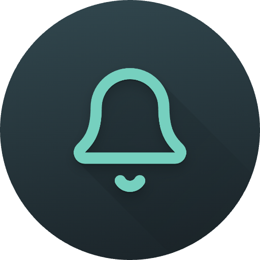

<div align="center">



# Memento

A single-screen reminders app and liquid-glass UI showcase, built with Flutter using no UI packages and no shaders.

[](https://flutter.dev)
[](https://dart.dev)
[](LICENSE)


**[▶ Try the live demo](https://petterikorpimaa.github.io/memento/)** (runs in the browser, no install)

</div>

## Screenshots


| Reminders list | Open modal | Settings and language |
| --- | --- | --- |
|  |  |  |

## What it is

Memento is a single-screen app with no backend. The reminders are real: they
persist to the device and fire OS notifications even when the app is closed. The
focus is a hand-built liquid-glass look and the animation around it, using only
the Flutter SDK. There is no state-management, routing, font, code-generation, or
shader package.

Features:

- In-house liquid glass: a `GlassSurface` widget clips a rounded superellipse,
  lays a translucent tint over an optional backdrop blur, and paints an edge rim.
- Custom animation: tap a tile to bring it closer (3D tilt and scale) and hand
  off into a floating modal; long-press to drag-reorder; press-and-drag a bell or
  delete button to paint the toggle across rows; a particle dissolve on delete.
- Persistence: the list (items, enabled state, order, running-timer anchors) is
  stored via `shared_preferences` and survives restarts.
- OS notifications: enabled reminders schedule local notifications via
  `flutter_local_notifications`.
- Localization: an in-house English and Finnish system with a language picker
  that remembers the choice.
- Targets Android, iOS, web, macOS, Windows, and Linux.

## What this demonstrates

- Custom rendering: the glass effect is a `CustomPainter` plus a clip, not a
  package or shader.
- Performance-aware lists: a test-guarded invariant keeps `BackdropFilter` off
  resting rows so a long list stays smooth.
- Testable architecture: constructor-injected repositories and services let the
  whole suite run on the test host with no device.
- Hand-rolled infrastructure: serialization and an English/Finnish i18n layer,
  both without codegen.

## How it works

Layered, with the UI depending on repository and service abstractions rather than
concrete storage:

```
Presentation   screens/ + widgets/    StatefulWidgets, painters, overlays
Domain/state   models/ + utils/       ReminderItem, pure math helpers
Data           data/                  ReminderRepository / LocaleRepository
Localization   l10n/                  AppLocale, AppStrings, LocaleController
Notifications  notifications/         NotificationService
```

`main()` injects the dependencies and threads them down through constructors.
Tests and a bare `const MyApp()` fall back to in-memory implementations, so the
UI suites run without touching disk or the OS.

Key points:

- Performance invariant: a `BackdropFilter` per row makes a long list janky, so
  resting tiles render tint and rim with blur off, and only an actively
  interacting tile turns the blur on. `test/glass_revert_test.dart` fails the
  build if a resting tile is left blurring. Keep this intact when changing glass
  code.
- Persistence: `ReminderState` is an immutable snapshot serialized to one JSON
  string by hand (no `json_serializable`); a corrupt blob falls back to empty.
  Production starts with an empty list; `kReminders` is a demo fixture only.
- Notifications: real on Android and iOS, no-op on web, desktop, and in tests.
- Localization: no `intl`, ARB, or codegen. Adding a string to `AppStrings` makes
  the compiler flag any language missing a translation. English is the default
  and fallback. `flutter_localizations` handles only the framework's own widget
  strings, such as the date picker month names.

For the full file-by-file map and rationale, see [`CLAUDE.md`](CLAUDE.md).

## Getting started

Prerequisites:

- Flutter SDK 3.44+ and Dart 3.12+ (developed against 3.44.2 / 3.12.2).
- Platform toolchains for the targets you build: Android Studio and SDK, Xcode
  and CocoaPods, or the Flutter desktop prerequisites.

Install:

```bash
git clone https://github.com/petterikorpimaa/memento.git
cd memento
flutter pub get
```

Run:

```bash
flutter run                # connected device or emulator
flutter run -d chrome      # web
flutter run -d macos       # desktop: macos | windows | linux
```

The app locks to portrait. OS notifications fire only on Android and iOS;
elsewhere the notification service is a no-op and everything else works.

### Using it

- Tap a tile's bell to arm its notification and, for a timer, start its
  countdown. Tap a tile body to open its editor modal. Long-press to drag and
  reorder.
- Tap edit in the header to enter edit mode, which turns bells into delete
  toggles. Mark tiles, then save (green check) to remove them with a dissolve, or
  cancel (red cross) to keep them.
- Press-and-drag a bell or delete button to paint the toggle across a range of
  rows.
- The settings button opens a compact-view toggle and a language picker
  (English / Suomi).

## Testing

```bash
flutter test                 # run everything
flutter test --coverage      # write coverage/lcov.info
flutter analyze              # static analysis
dart format .                # formatting
```

The suites cover UI flows, the glass performance invariant, state and
persistence, the data layer, notifications, localization, and the pure math
helpers. They run on the Flutter test host with no devices, using fakes and
in-memory repositories.

HTML coverage report (needs `lcov`):

```bash
genhtml coverage/lcov.info -o coverage/html && open coverage/html/index.html
```

## Building

Change the placeholder identifier (`com.example.*`) to your own before
publishing.

```bash
flutter build apk            # Android APK
flutter build appbundle      # Play Store AAB (configure signing first)
flutter build ipa            # iOS (Xcode signing configured)
flutter build web            # static output in build/web/
flutter build macos          # desktop: macos | windows | linux
```

Signing: set up a keystore and `android/key.properties` for Android releases;
configure your team and bundle id in Xcode for iOS and macOS. For web served from
a subpath, use `flutter build web --base-href /<repo>/`.

### App icons

Launcher icons are pre-generated per platform and installed in each native
location (no `flutter_launcher_icons`):

- iOS: `ios/Runner/Assets.xcassets/AppIcon.appiconset/`
- Android: `android/app/src/main/res/mipmap-*/`
- Web: `web/favicon.ico`, `web/apple-touch-icon.png`, `web/icons/Icon-*.png`

The raw export is kept under [`icon/`](icon/). Replace the files in those
locations to change the icons. Desktop icons were not part of the export and use
the Flutter defaults.

## Project structure

```
lib/
├── main.dart        MyApp / MaterialApp, DI wiring, LocaleScope, theme
├── constants/       AppDurations (animation timings)
├── models/          ReminderItem, ReminderType, ReminderColors, kReminders fixture
├── data/            reminders + locale repositories (shared_prefs + in-memory)
├── l10n/            AppLocale, AppStrings (en/fi), LocaleController, LocaleScope
├── notifications/   NotificationService (local + no-op)
├── utils/           TimerMath (pure countdown math)
├── screens/         home_shell, reminders_screen, settings_screen
└── widgets/         glass, reminder tile/modal/chip, reorderable list, and pure
                     helpers (reorder, drag-tilt, paint-sweep, modal-geometry)
test/                test suites (see Testing)
icon/                raw per-platform launcher-icon export
CLAUDE.md            full architecture and conventions reference
```

## Conventions

The full list is in [`CLAUDE.md`](CLAUDE.md). The essentials:

- Built-in state only: no provider, bloc, or riverpod.
- Immutability: rebuild collections immutably, never mutate in place.
- No codegen: hand-written serialization.
- Small files, 80-character lines, `PascalCase` types, `camelCase` members,
  `snake_case` filenames.
- Keep the glass performance invariant, and run `flutter analyze` and
  `flutter test` before a PR.

> Naming: the display name and window title are "Memento" and the Dart package is
> `memento` (imports are `package:memento/...`); the in-app header shows the
> localized "Reminders" / "Muistutukset".

## License

[MIT](LICENSE) © 2026 Petteri Korpimaa.
